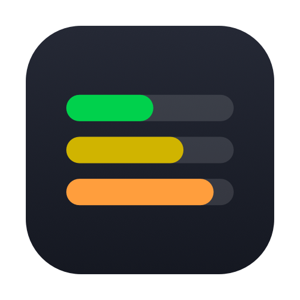
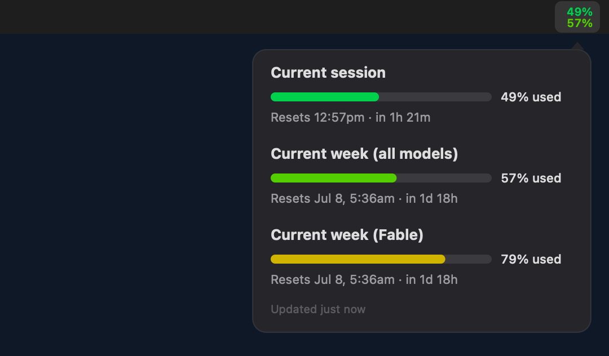

# Claude Usage Stats

A tiny macOS menu-bar app that shows your Claude Code usage at a glance — the
same numbers as the `claude /usage` command, always visible.

- **Top line** — current **session** usage %
- **Bottom line** — current **week (all models)** usage %
- **Click** — a detail panel with all three windows (session, week all-models,
  and your active model's weekly limit), each with a progress bar and a reset
  line showing the local time and how long until reset.



The two percentages are **auto-colored by usage range**, using colors verified
to meet **WCAG AAA** (≥7:1 contrast) against both light and dark menu bars:

| Range | < 50 | 50–69 | 70–84 | 85–94 | ≥ 95 |
|-------|------|-------|-------|-------|------|
| Tier  | green | lime | gold | orange | red |

## Install

```bash
curl -fsSL https://raw.githubusercontent.com/openhoangnc/claude-usage-stats/main/install.sh | bash
```

Builds from source (needs Xcode command-line tools) and installs to
`/Applications`. Enable **Launch at Login** from the menu (click the indicator →
Launch at Login).

## Uninstall

```bash
curl -fsSL https://raw.githubusercontent.com/openhoangnc/claude-usage-stats/main/uninstall.sh | bash
```

## How it works

There's no public usage API, so the app does exactly what the CLI does:

1. Reads your Claude Code sign-in token from the login Keychain
   (`Claude Code-credentials`).
2. Calls `GET https://api.anthropic.com/api/oauth/usage` with that token.
3. Renders the `limits` it returns.

Nothing is sent anywhere except that one request to Anthropic — the same call
`claude /usage` makes. The app **never writes** to your Keychain.

**First launch:** the app explains this, then macOS shows a one-time Keychain
prompt ("ClaudeUsageStats wants to use … Claude Code-credentials"). Click
**Always Allow**.

**Token expiry:** Claude Code tokens last ~5 hours and Claude Code refreshes
them as you use it. If you haven't used Claude Code in a while the token can be
expired; the app keeps showing the last numbers and the tooltip explains — just
use Claude Code once to refresh. (The app deliberately doesn't refresh tokens
itself, to avoid touching your login credentials.)

## Build from source

```bash
./make_icon.sh    # generates AppIcon.icns + icon.png
./build.sh        # compiles ClaudeUsageStats.app
open ClaudeUsageStats.app
```

## Requirements

- macOS 11+
- Signed in to Claude Code (`claude`) on this machine
- Xcode command-line tools (`swiftc`) to build

## Debugging

```bash
# Print what the menu bar / panel would show, without the GUI or Keychain.
CLAUDE_USAGE_TOKEN=… ./ClaudeUsageStats.app/Contents/MacOS/ClaudeUsageStats --selftest

# Re-render the README screenshot from the real views.
./ClaudeUsageStats.app/Contents/MacOS/ClaudeUsageStats --screenshot screenshot.png
```

Refresh runs every 120s and whenever you open the menu. The panel footer shows
when the data was last updated.
